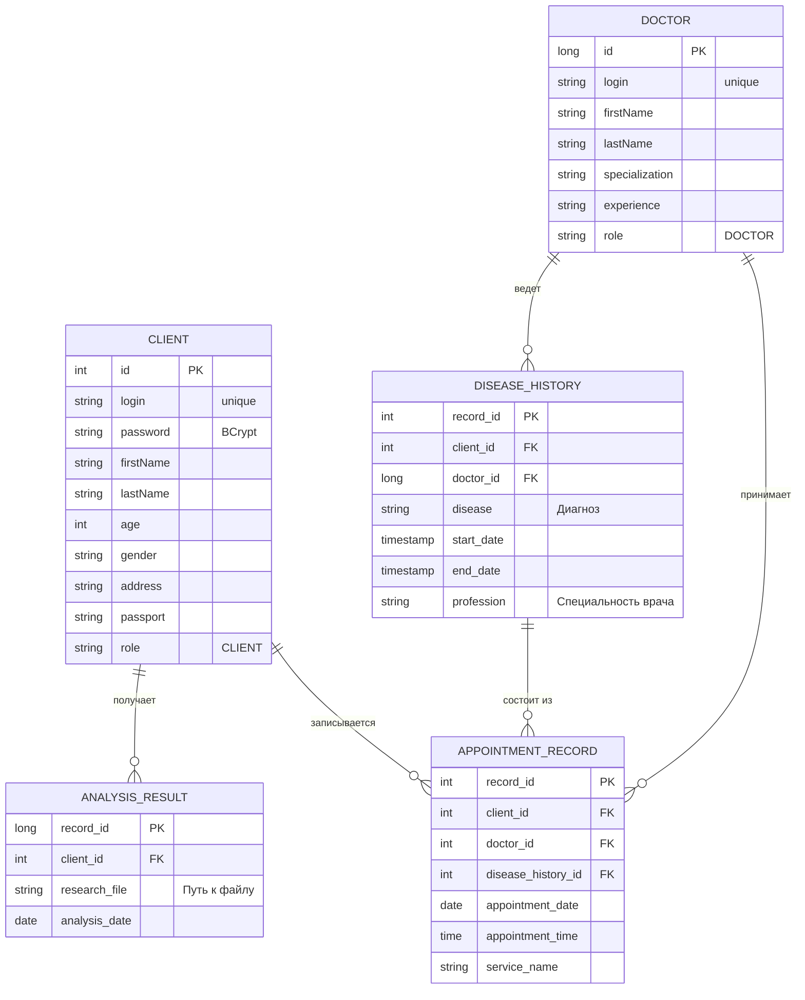
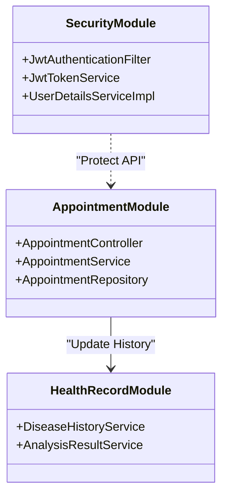
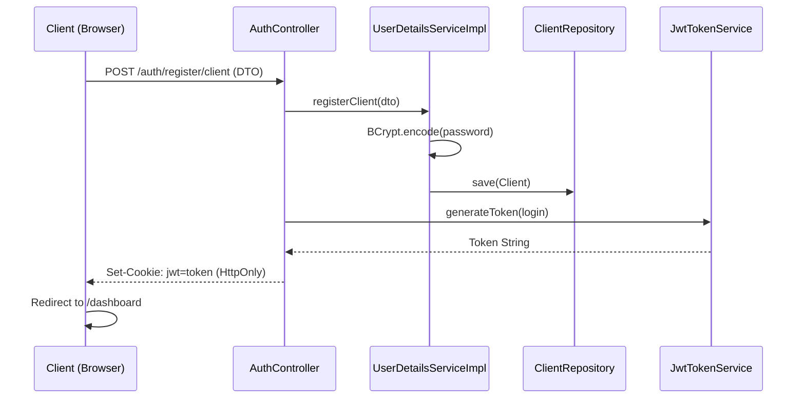
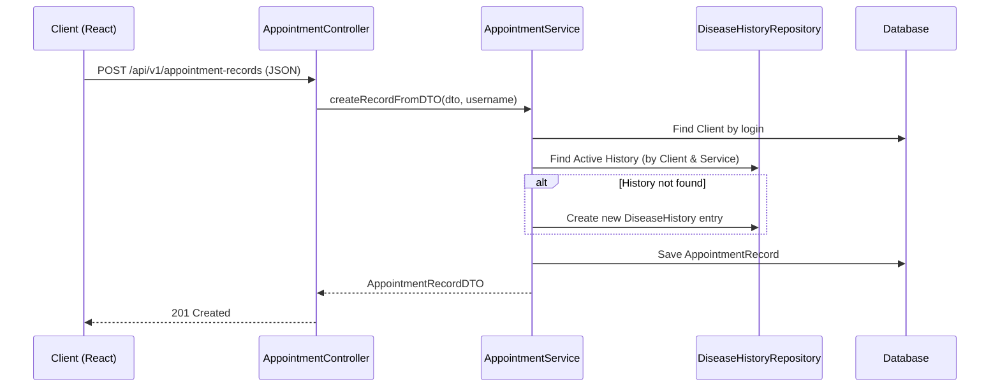

# laboratory-TCP

## 1. Цели проекта и технологии (в 3 разделе общая архитектура)
**Laboratory-TCP** — это информационная система для автоматизации ветеринарной клиники, построенная на базе современных enterprise-стандартов.

### Основные цели:
*   **Демонстрация и тренировка работы со Spring Security и сохранением ролей в JWT:** Реализация надежной системы аутентификации и авторизации (RBAC) с использованием Stateless-токенов и механизма Blacklist для выхода из системы.
*   **Гибридный Frontend (Thymeleaf + React):** Использование классического серверного рендеринга для структуры сайта и внедрение реактивных SPA-модулей (React + Vite) для сложных интерфейсов управления данными.
*   **Управление данными и миграции:** Организация персистентного слоя с использованием Spring Data JPA и сохранение структуры БД через Liquibase.
*   **Контейнеризация:** Полная изоляция приложения и окружения через Docker для упрощения развертывания на разных ПК и версиях JDK, maven и других инструментов Spring Boot.

### Технологический стек:
*   **Backend:** Java 21, Spring Boot 3.x, Spring Security (JWT), Spring Data JPA, Liquibase, PostgreSQL.
*   **Frontend:** React 18, Vite, Thymeleaf, CSS3.
*   **DevOps:** Docker, Docker Compose.
## 2. Запуск проекта в контейнере
 - клонируйте репозиторий: https://github.com/HyperKa/laboratory-TCP.git
 - убедитесь, что вы в корне проекта и соберите контейнеры: docker-compose up --build -d
 - доступ по localhost:8080; для доступа к БД желательно использовать pgAdmin4, логин - postgres, пароль - 1234 
 - При запуске автоматически создаются тестовые сущности в таблицах Admin (логин - admin, пароль - admin), Doctor (doctor1, 1234) и Client (client1, 1234)

## 3. Архитектура приложения: 

### Схема базы данных (ER-диаграмма)
Используется postgresql. Ниже представлена связь основных сущностей системы:

### Общая структура бекенда представлена на диаграмме классов:

### Диаграмма последовательностей (регистрация клиента)

### Диаграмма последовательностей (запись на прием)

### Фронтенд состоит из React-блоков, внедренных в Thymeleaf контейнеры на html:
- PatientManager: Просмотр и редактирование данных владельцев животных (Доступ: ADMIN/DOCTOR).
- AppointmentRecordManager: Управление очередью записей в реальном времени.
- DiseaseHistoryManager: Интерактивная лента болезни с фильтрацией по ролям.
- AnalysisResultManager: Модуль загрузки и просмотра лабораторных исследований.